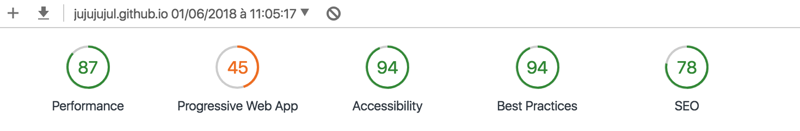

# Fil-Rouge-Guerilla-Style: PHASE 1

## Mission commando

Réaliser en 7h un site internet sur base d'une ASBL imposée disposant d'un site actuellement non approprié. 

- Association imposée: La Babillarde (services d'accueil de jeunes enfants à domicile). 

- Problème de base: Site non complet, pas esthétique et non responsive.

## Consigne de base > 9H

Durant cette phase, la règle d'or fut le respect d'une deadline de 7h

- Creer un repository sur GitHub

- Check du contenu actuel du site imposé

- Choisis une template (ou pas).

- Une fois publié, utilise le [Lighthouse Test]

- Publier le resultat via un formulaire avant 16h30

** 16h30 > mission accomplie

## Difficultés rencontrées

Les couleurs, les bordures et les background ... Il fut parfois difficile de trouver une harmonie professionnelle. 
Pour nommer les id et les classes, je ne trouve jamais d'idées, donc vous remarquerez que c'est parfois un peu aléatoire...

## Déroulement et méthode:

- Je ne me suis pas basée sur un template, j'ai plutot décidé du design de la page moi même avec l'aide de bootstrap. 
Je n'aime pas les template, je trouve qu'ils respectent une disposition souvent semblable.

- J'ai en premier lieux visiter des sites internet ayant le même sujet que celui-ci, à savoir l'accueil de jeune enfants à la maison. 

- J'ai fait un plan à la main que j'ai modifié tout au long de ma mission.

- J'ai commencé par retranscrire tous mes textes. Je les ai tous modifiés et j'ai retiré ce qui me semblait de trop, afin de ne pas submerger le lecteur de trop d'informations. 

- J'ai construit mon html toute la matinée.

- J'ai passé l'après-midi à ajouter le boostrap, le css, et donc à chercher des background, font, couleurs harmonieuses.

- La grande majorité du travail s'est déroulée durant la dernière heure du défi! Comme à mon habitude (boostée par la deadline).

- J'ai adoré ce défi.

## Test lighthouse

## Situation finale

Je trouve le site internet que j'ai réalisé plus cohérent que celui existant pour Babillarde. 
Certains détails sont à ajouter, qui feront je pense beaucoup de différence et manifesteront mon professionnalisme: le fait que je n'ai pas pris de template préexistante marque une grande différence visuelle par rapport aux résultats des autres membres de l'équipe. Cela donne en effet un coté moins pro, que je dois donc largement améliorer !!! 

